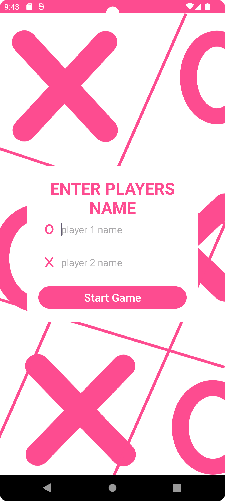
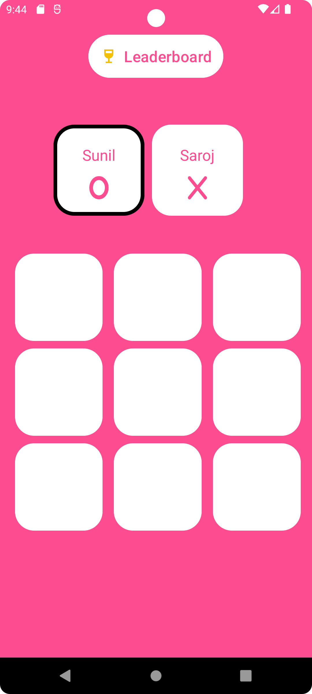
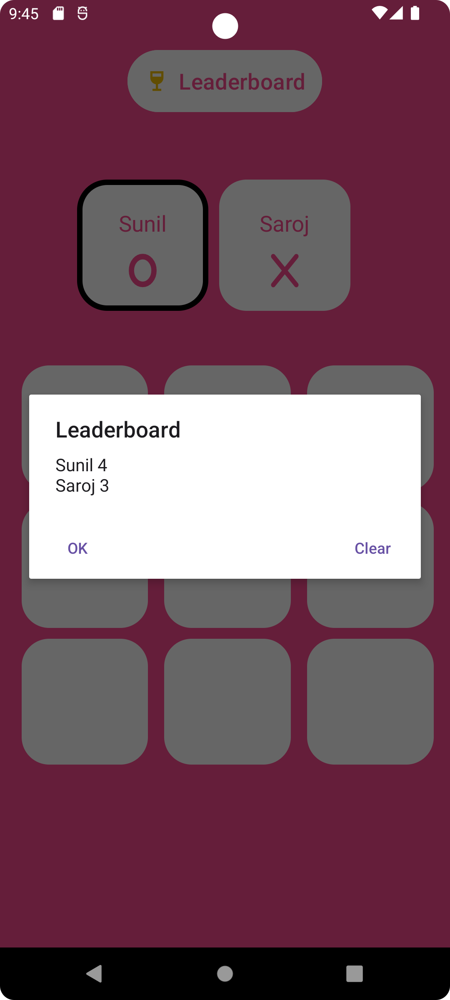

# TickToe Game - Android Game Project

Welcome to the **TickToe Game** Android application repository! This project is a Tic-Tac-Toe game with additional features such as player name storage using Shared Preferences, SQLite database for leaderboard data, KonfettiView animation for winners, and sound effects on winning. This readme will guide you through the project setup and showcase its features.

## Screenshots and GIF

Check out the visuals of the application:


<div align="center">
   &nbsp;&nbsp;
   &nbsp;&nbsp;
   &nbsp;&nbsp;
</div>

### Winner Animation

<div align="center">
  
</div>

## Features

- Tic-Tac-Toe Game
- Player Name Storage using Shared Preferences
- Leaderboard Management with SQLite Database
- Winner Celebration Animation with KonfettiView
- Sound Effects on Winning

## Getting Started

Follow these steps to set up the project on your local machine:

### Prerequisites

- Android Studio (latest version recommended)

### Setup

1. **Clone the repository:**

    ```bash
    git clone https://github.com/your-username/ticktoe-game.git
    ```

2. **Open the Project in Android Studio:**

    Open Android Studio and select "Open an existing Android Studio project." Navigate to the cloned repository's directory and open the project.

3. **Run the Application:**

    Build and run the application on an emulator or a physical device.

## Additional Notes

- The game uses Shared Preferences to store and retrieve player names.
- SQLite database is utilized to manage and display the leaderboard data.
- KonfettiView is employed for winner celebration animations.
- Sound effects are played upon winning.

## Contributing

Feel free to contribute to the project by submitting issues and pull requests. Your contributions are highly appreciated!

## License

This project is licensed under the [MIT License](./LICENSE).

---

Thank you for using TickToe Game! If you have any questions or need further assistance, don't hesitate to contact us.
